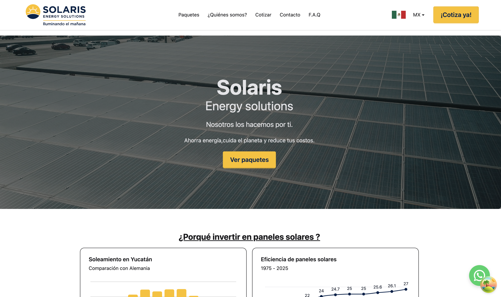
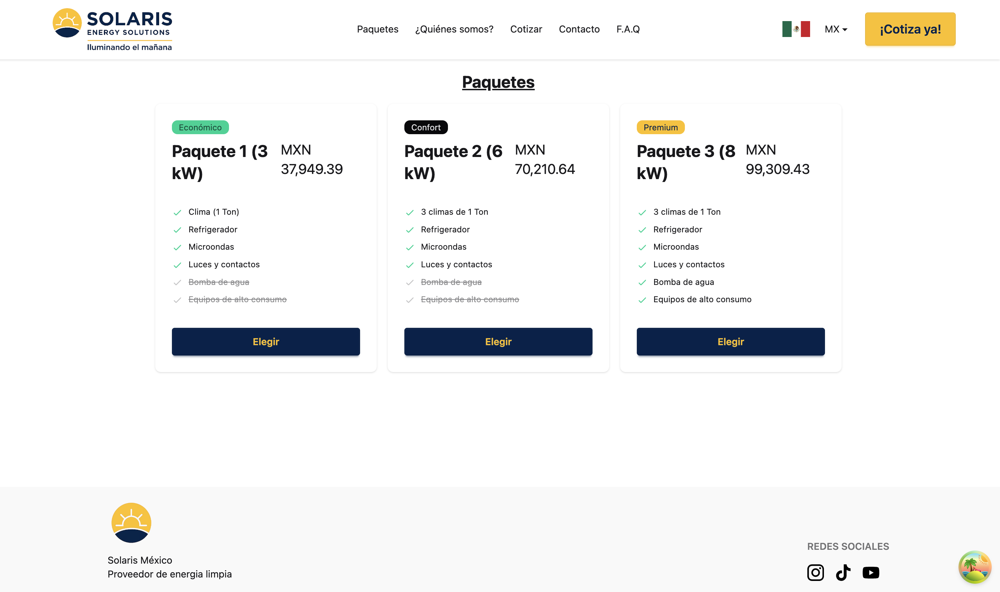

<div align="center">

# 🌟 Solaris : a solar cell installation app

🚀 A modern full-stack application built with **Express, Prisma, React, Zustand & TailwindCSS**.

🎨 Fast, stylish & scalable — from backend to UI.

<hr/>

### 📸 App Preview

| Home | Dashboard | Other |
|------|-----------|-------|
|  |  |  |

> 🖼️ _All images are located in the repository root._

</div>

---

## 🧱 Tech Stack

<div align="center">

| Category | Technology |
|----------|------------|
| **Frontend** |    |
| **Backend** |  |
| **Database** |  |

</div>

---

## 🔧 Installation & Setup

### 📥 Clone Repo

```bash
git clone git@github.com:Francois-T9/solaris.git
cd your-repo-name
